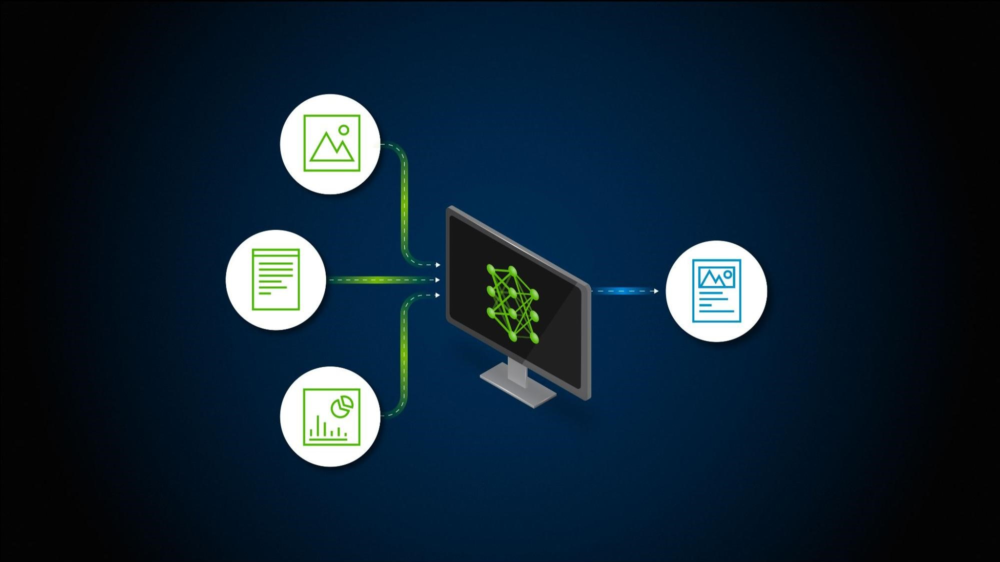
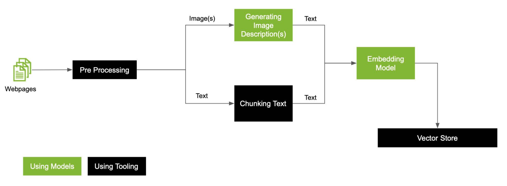

<!-- PROJECT LOGO -->   
 

# Multimodal Retrieval System

## Description
This repository contains the implementation of a **Multimodal Retrieval System** that utilizes both textual reviews and corresponding images as input data to retrieve similar image-review pairs. The system extracts features from both text and images, calculates similarity scores, and ranks the pairs based on composite similarity scores.
This project aims to develop a Multimodal Retrieval System using Python, focusing on feature extraction from text and images, similarity calculation, and retrieval ranking. It follows specific instructions provided by the instructor for preprocessing techniques, feature extraction, and similarity measures.

## Approach

### Image Feature Extraction:
- Implemented basic image pre-processing techniques such as resizing and normalization.
- Utilized a pre-trained Convolutional Neural Network (CNN) architecture (ResNet18) to extract relevant features from images.
- Normalized the extracted features.

### Text Feature Extraction:
- Implemented text pre-processing techniques including lowercasing, tokenization, punctuation removal, stop word removal, stemming, and lemmatization.
- Calculated Term Frequency-Inverse Document Frequency (TF-IDF) scores for textual reviews.

### Image and Text Retrieval:
- Utilized cosine similarity as the similarity measure.
- Retrieved the most similar images and reviews for input image-review pairs based on extracted features and TF-IDF scores, respectively.
- Saved the results using Python's `pickle` module.

 </a>

### Combined Retrieval (Text and Image):
- Calculated a composite similarity score (average) for pairs generated from image and text retrieval.
- Ranked the pairs based on the composite similarity score.

## Results and Analysis:
- Presented top-ranked image-review pairs along with cosine similarity scores.
- Compared the performance of image and text retrieval techniques.
- Discussed challenges faced and potential improvements in the retrieval process.

## Implementation Details
- Implemented in Python using TensorFlow, NLTK, and other relevant libraries.
- Consists of modular code organized into separate modules for image processing, text processing, retrieval, and analysis.

## Code Structure
- `data_preprocessing.py`: Contains functions for image and text pre-processing.
- `feature_extraction.py`: Implements image feature extraction using ResNet18 and text feature extraction using TF-IDF.
- `retrieval.py`: Implements image and text retrieval functions based on cosine similarity.
- `utils.py`: Contains utility functions for data loading, saving results, etc.

## Usage
1. Clone the repository to your local machine.
2. Install the required dependencies using `pip install`.
3. Run the main script to execute the retrieval system.
4. View the results and analysis in the output.

## Sample Test Case

**Input:**
- **Image and Text Query Input**:
  - Image: [Sample Image URL]
  - Review: "Sample text review"

**Output:**

- **Using Image Retrieval**
  - Image URL: [List of Image URLs]
  - Review: Corresponding review
  - Cosine similarity of images: `xx.xxxx`
  - Cosine similarity of text: `xx.xxx`
  - Composite similarity score: `xx.xxxx`
  
- **Using Text Retrieval**
  - Image URL: [Corresponding List of Image URLs]
  - Review: Extracted Review
  - Cosine similarity of images: `xx.xxxx`
  - Cosine similarity of text: `xx.xxx`
  - Composite similarity score: `xx.xxxx`

 

## Conclusion
The **Multimodal Retrieval System** successfully retrieves relevant image-review pairs based on extracted features from both text and images. The system demonstrates the effectiveness of combining text and image modalities for retrieval tasks.

## Author Information
**Name**: Talkative-Banana

## License
This project is licensed under the MIT License - see the LICENSE file for details.
